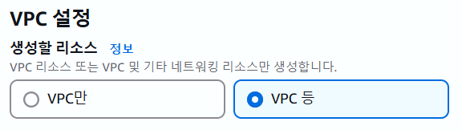
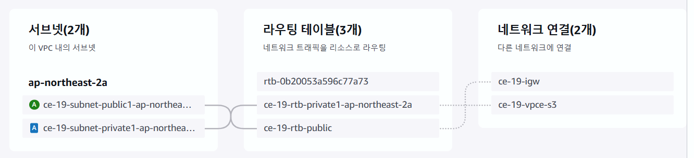

# Private Jenkins in VPC : 안전한 CI/CD 구성

Public이 아닌 **Private EC2 인스턴스**에서 Jenkins를 설치하고 운영하기 위한 인프라 구조를 구성했습니다.  
외부와의 직접적인 접속 없이도 GitHub Webhook 등 자동화된 작업을 수행할 수 있도록   Public EC2를 활용한 **프록시 및 포워딩** 구조를 도입했습니다.

 

### 📆 프로젝트 기간
- 2025.04.08 ~ 04.09

 

### 🎯 프로젝트 목표
- Public / Private 서브넷으로 구성된 **VPC 아키텍처** 구축
- Private EC2 인스턴스에 Jenkins 설치 및 운영
- Public EC2를 통한 Private Jenkins 접근 환경 구성 (ngrok 활용)

 

### 📜 구축 과정 요약
1. VPC 이중 서브넷 구성 

2. EC2 인스턴스 구성 및 키페어 연결

3. Private EC2에 Jenkins 설치 (`trusted=yes`로 GPG 문제 해결)

4. **Public EC2에ngrok 설치 및 Jenkins 포트 포워딩 설정**

5. GitHub Webhook 연동 → Public을 통해 Private Jenkins 트리거

 

## 주요 구성요소

### 1️ VPC : 퍼블릭 서브넷 + 프라이빗 서브넷

▪ VPC 생성 시 네트워크 구성요소가 자동으로 함께 만들어지는 option 선택

 

▪ 가용 영역(AZ) 및 Public / Private 서브넷 1개씩 생성  

 

### 2️⃣ EC2

▪ **Public EC2 : ngrok 및 APT Proxy 역할**   
    - Public EC2의 보안 그룹에서 인바운드 규칙 추가  
    - 포트 3142는 APT 프록시 서버인 apt-cacher-ng의 기본 통신 포트  
    - 포트 8080은 ngrok의 통신 포트

 

▪ **Private EC2 : Jenkins 설치**   
    - Jenkins : Private 인스턴스에 직접 설치 (`apt install`)  
    - ngrok : Public EC2에서 실행하여 Private Jenkins에 대한 외부 터널링 제공

 

### 3️⃣ MobaXterm
▪ Public EC2를 통한 Private EC2 접근용 SSH 툴   
    - 로컬 PC에서 MobaXterm을 통해 Public EC2에 접속  
    - Public EC2에서 Private EC2로 SSH 접속해 Jenkins 설정 및 실행 수행  
    - VPC 내에서 외부망 없이도 Private 리소스를 조작할 수 있도록 지원

 

## 🧩 트러블슈팅 요약

- Gradle 설치 오류 → gradle zip 수동 업로드 및 로컬 경로 지정

- 플러그인 의존성 오류 → 직접 .hpi 다운로드 후 설치

- ngrok 구버전 → 최신 버전 수동 설치

